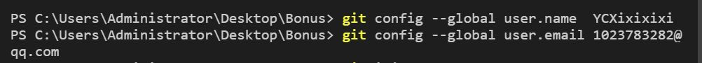
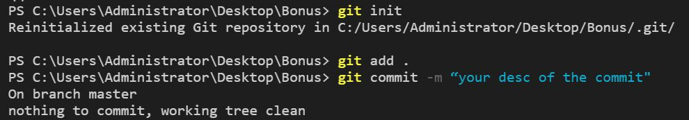
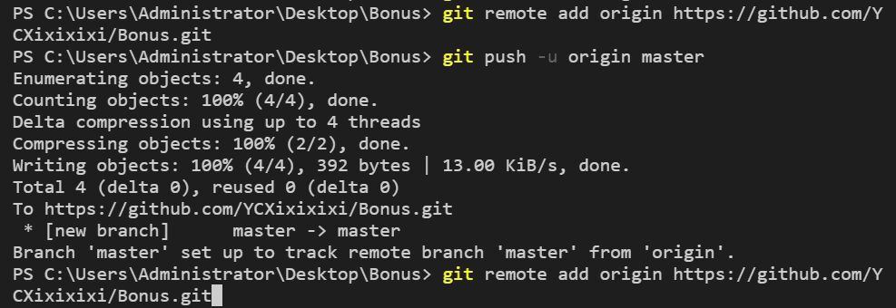
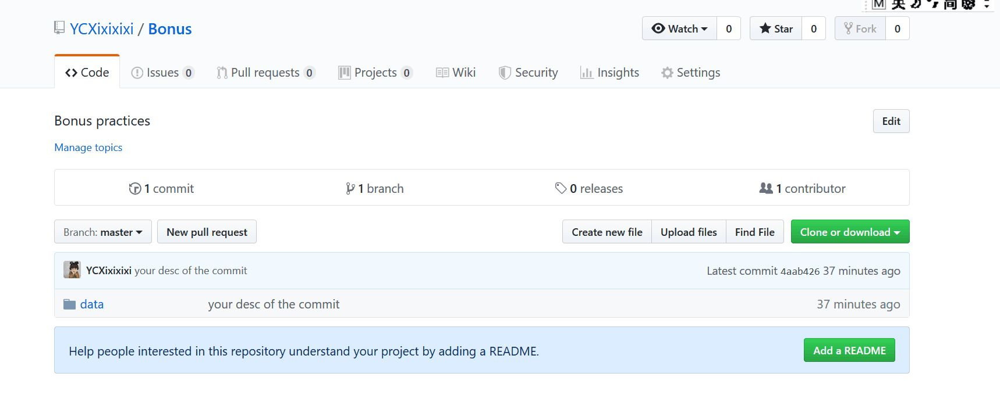
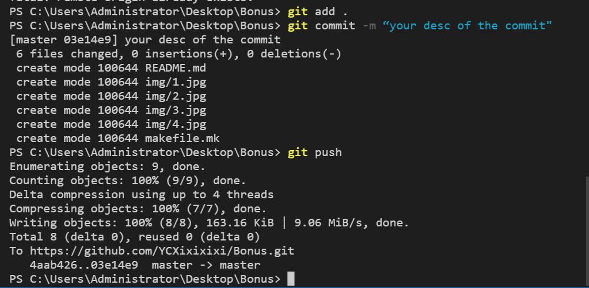
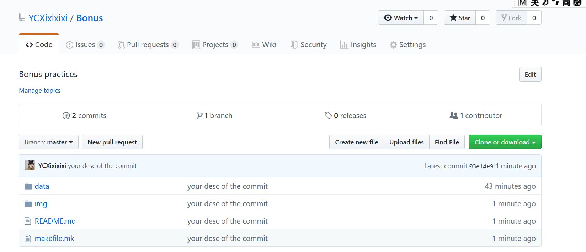

注：本次作业只完成了“Version control with Git,Github”部分。

Version control with Git,Github

1.本地Git和远程Github版本控制的初始化
    

2.使用Git对本地项目进行版本控制
    

3.本地仓库的远程Github仓库初始化
    
  
  第一次更新的仓库截图如下：
  （由于没有完成第一部分任务，进行到此步时只先在data文件夹中放了数据文件）
    

4.本地仓库工作内容变化更新、同步到远程github
  按要求把作业文件中的其他部分添加好，编辑好README文件后再次更新。
      
  此时新的仓库截图如下：
      
